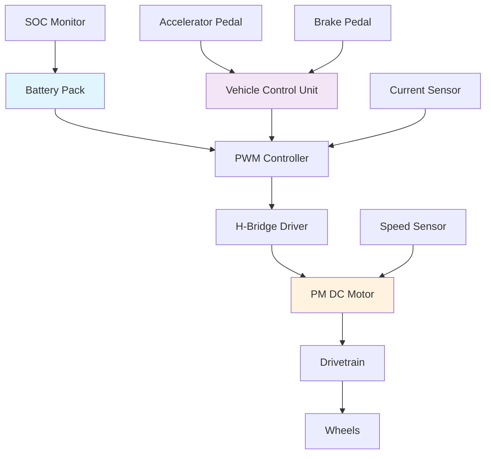
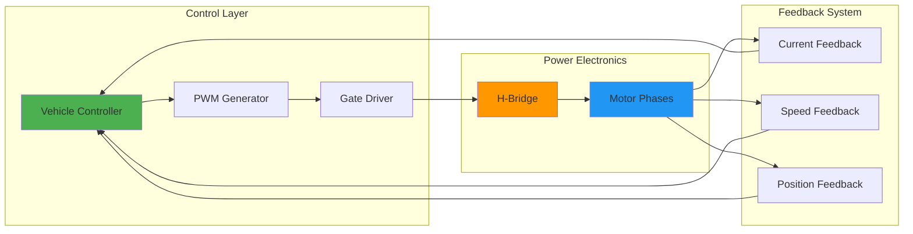
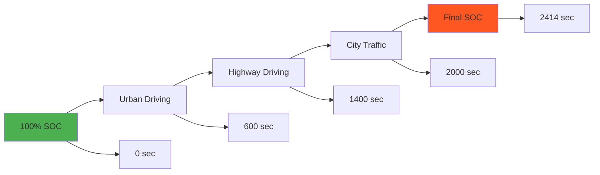
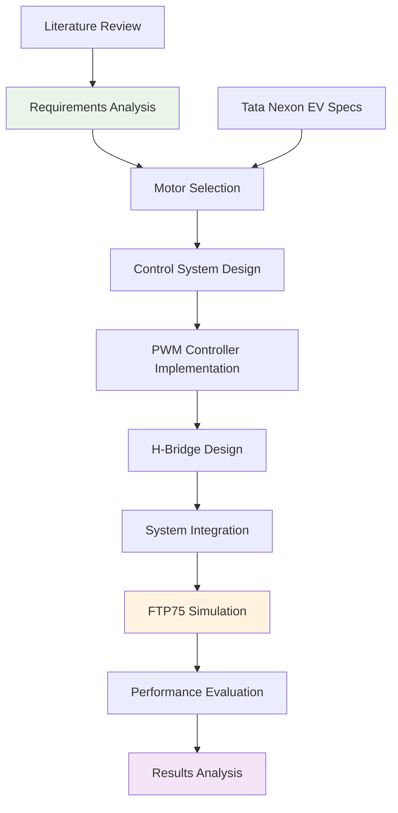

# Electric Vehicle Design Project - Tata Nexon EV

## 🚗 Project Overview

This project presents a comprehensive design and simulation of an electric vehicle based on the **Tata Nexon EV** platform. The study focuses on implementing a permanent magnet DC motor with advanced PWM control systems and evaluating performance through standardized driving cycle simulations.

## 🎯 Objectives

- Design and simulate an electric vehicle powertrain system
- Implement PWM-controlled permanent magnet DC motor
- Analyze vehicle performance under FTP75 driving cycle
- Monitor battery State of Charge (SOC) throughout operation
- Validate system performance against passenger car requirements

## 🔧 System Architecture

### Motor Configuration
- **Motor Type**: Permanent Magnet DC Motor
- **Control System**: PWM (Pulse Width Modulation) controlled source
- **Driver Circuit**: H-Bridge configuration
- **Application**: Passenger car drivetrain

### System Components Flow

## ⚡ Technical Specifications

### Performance Requirements
- **Vehicle Type**: Passenger Car (Tata Nexon EV)
- **Simulation Duration**: 2414 seconds
- **Test Cycle**: FTP75 (Federal Test Procedure)
- **Motor Control**: PWM with H-Bridge
- **Battery Monitoring**: Real-time SOC tracking

### Control System Architecture

## 📊 Simulation Results

### FTP75 Driving Cycle Performance

The vehicle model was tested under the FTP75 driving cycle, which represents urban driving conditions with:
- **Total Duration**: 2414 seconds
- **Distance Covered**: Approximately 17.77 km
- **Average Speed**: 26.4 km/h
- **Maximum Speed**: 91.2 km/h

### Battery State of Charge Analysis

## 🛠️ Implementation Details

### PWM Control Strategy
- **Switching Frequency**: Optimized for motor efficiency
- **Modulation Technique**: Sinusoidal PWM
- **Control Algorithm**: Proportional-Integral (PI) control

### H-Bridge Configuration
- **Topology**: Full H-Bridge
- **Switching Devices**: MOSFETs
- **Protection**: Overcurrent and overvoltage protection

## 📈 System Performance Metrics

### Motor Performance
- **Power Rating**: Suitable for passenger car application
- **Efficiency**: Optimized through PWM control
- **Torque Characteristics**: Constant torque at low speeds
- **Speed Range**: Variable speed control

### Battery Management
- **Initial SOC**: 100%
- **Final SOC**: [To be determined from simulation]
- **Energy Consumption**: Calculated over FTP75 cycle
- **Range Estimation**: Based on consumption patterns

## 🔍 Methodology

### Design Process Flow

## 📚 References and Study Materials

### Primary Sources
1. **Skill-Lync Project**: [Final Project Design of an Electric Vehicle](https://skill-lync.com/student-projects/final-project-design-of-an-electric-vehicle-308)
2. **YouTube Tutorial**: [EV Design Fundamentals](https://youtu.be/oifGuqIjq1A?si=ZFOeYqsIt9TPpFF7)
3. **Educational Playlist**: [Electric Vehicle Design Series](https://youtube.com/playlist?list=PLkNpfXWK1twz95zTfjzO_7FijrmzppBkw&si=rmu-s3P_0HXFk)

### Technical Standards
- **FTP75**: Federal Test Procedure for vehicle emissions and fuel economy
- **SAE Standards**: Electric vehicle performance metrics
- **ISO 26262**: Functional safety for automotive systems
- **Regenerative Braking**: Energy recovery during deceleration

## 🚀 Future Enhancements

### Potential Improvements
- **Advanced Battery Management**: Thermal management and cell balancing
- **Adaptive Control**: Machine learning-based optimization
- **Real-time Optimization**: Dynamic efficiency improvements

### Extended Testing
- **WLTP Cycle**: Worldwide harmonized Light vehicles Test Procedure
- **Real-world Validation**: Field testing and validation
- **Thermal Analysis**: Component temperature monitoring

## 💡 Key Innovations

1. **PWM Control Integration**: Seamless motor control with efficiency optimization
2. **Battery SOC Monitoring**: Real-time state estimation
3. **Standardized Testing**: FTP75 compliance for realistic performance evaluation
4. **Modular Design**: Scalable architecture for different vehicle platforms

## 🔧 Installation and Setup

### Prerequisites
- MATLAB/Simulink environment
- Vehicle dynamics simulation tools
- Motor control toolboxes
- Battery modeling libraries

### Running the Simulation
1. Load the vehicle model parameters
2. Configure PWM controller settings
3. Set up FTP75 driving cycle profile
4. Initialize battery SOC parameters
5. Execute simulation for 2414 seconds
6. Analyze results and generate reports

---

**Project Status**: ✅ Partially Completed  
**Last Updated**: 2025 
**Version**: 1.0  

## ⚠️ Important Note

This simulation project was conducted as an educational exercise and experimental study. The results and performance metrics presented in this work are based on theoretical models and simulations. **We do not claim the correctness or accuracy of these results when compared to the actual Tata Nexon EV vehicle performance.** 

The purpose of this project is to demonstrate understanding of electric vehicle design principles, motor control systems, and simulation methodologies. Any practical implementation or real-world application should involve proper validation, testing, and verification with actual vehicle specifications and performance data.

*This project demonstrates the practical application of electric vehicle design principles with focus on motor control and performance evaluation for educational purposes.*
